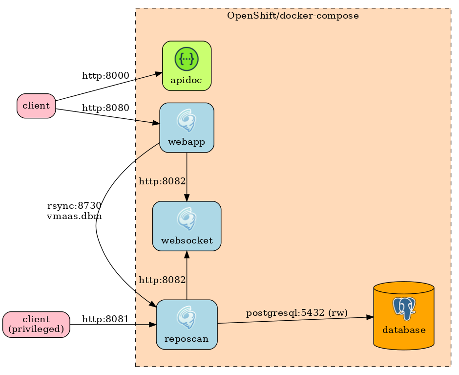

# VMaaS
**V**ulnerability **M**etadata **a**s **a** **S**ervice

## What Is This Thing?
VMaaS is intended to be a microservice that has access to data connecting RPMs,
repositories, errata, and CVEs, and can answer the question "What security changes do I
have to apply to the following set of RPMs?"
TEST

The goal is to have a common set of data, that can be updated from multiple sources, and
accessed from an arbitrary number of web-service instances. To that end, `database`
contains the docker-definitions for getting the data store up and running, `webapp` is the
service that uses the data to answer a variety of vulnerability-related questions, and
`reposcan` is an example of a plugin whose job is to fill the datastore with vulnerability
information.

## What ISN'T This Thing?
VMaaS is **NOT** intended to be an inventory-management system. It doesn't 'remember'
system profiles or containers, or manage inventory workflow in any way. An
inventory-management system could use VMaaS as one source of 'health' information for the
entities being managed.

## Architecture

## Quick Command Guide

### Local deployment (development)

#### All-in-one command magic
~~~bash
docker-compose up      # Build images and start containers
docker-compose down    # Stop and remove containers (built images will persist)
docker-compose down -v # Stop and remove containers and database data volume (built images will persist)
~~~

#### Build images
~~~bash
docker-compose build
~~~

#### Managing containers
All at once
~~~bash
docker-compose start
docker-compose stop
~~~

Single service
~~~bash
docker-compose start vmaas_database
docker-compose stop vmaas_database
~~~

### Run tests
You can run all tests from scratch just after cloning repo using command:
~~~bash
docker-compose -f docker-compose.test.yml up --build --abort-on-container-exit
~~~

### Developing / Debugging
You can build and start your container in ["developer mode"](doc/developer_mode.md).
You can tune metrics using Prometheus and Grafana dev containers, see [doc/metrics.md](doc/metrics.md).

### Copy database from live OpenShift instance (requires valid credentials)
~~~bash
oc project vmaas-stage
# Dump database
oc exec -c vmaas-reposcan-service $(oc get pod -l pod=vmaas-reposcan-service --no-headers -o custom-columns=:metadata.name) -- bash -c 'PGPASSWORD=vmaas_writer_pwd pg_dump -h $(python3 -c "import app_common_python as a;print(a.LoadedConfig.database.hostname)") -U vmaas_writer vmaas | gzip > /data/pgdump.sql.gz'
# Download database dump
oc port-forward $(oc get pod -l pod=vmaas-reposcan-service --no-headers -o custom-columns=:metadata.name) 10000:10000
curl http://localhost:10000/pgdump.sql.gz > /tmp/pgdump.sql.gz
# Populate local database
docker-compose up -d
docker-compose exec vmaas_database psql -U vmaas_admin postgres -c "drop database vmaas"
docker-compose exec vmaas_database psql -U vmaas_admin postgres -c "create database vmaas"
cat /tmp/pgdump.sql.gz | gzip -d | docker-compose exec -T vmaas_database psql -U vmaas_admin vmaas
# Generate new webapp sqlite dump
./scripts/turnpike-mock curl -X PUT http://localhost:8081/api/v1/export/dump
~~~

### Profiling
Webapp-go can be profiled using [/net/http/pprof](https://pkg.go.dev/net/http/pprof). Profiler is exposed on app's private port.
#### Local development
- set `ENABLE_PROFILE=true` in the `conf/common.env`
- `docker-compose up --build`
- `go tool pprof http://localhost:9000/debug/pprof/{heap|profile|block|mutex}`
#### Admin API
- set `ENABLE_PROFILE=true` in the ClowdApp
- download the profile file using internal api `/api/vmaas/v1/pprof/{heap|profile|block|mutex|trace}`
- `go tool pprof <saved.file>`

## Running on disconnected environments

VMaaS Reposcan can run on a disconnected environment, supported by [Katello](https://theforeman.org/plugins/katello/) (Foreman plugin).

Please note, that evaluation of manually fixable / not fixable CVEs is not supported in disconnected environments yet.

The following environment variables can be used to utilize it:

* `SYNC_REPO_LIST_SOURCE=katello`
* `KATELLO_URL` -- Katello URL (ex: `https://foreman.example.com`)
* `KATELLO_API_USER` -- (Optional) Katello user that has access to list Katello repositories and get debug certificates (i.e. admin)
* `KATELLO_API_PASS` -- (Optional) password of the Katello user
* `REDHAT_CVEMAP_URL` -- full URL of [`cvemap.xml`](https://www.redhat.com/security/data/metrics/cvemap.xml) location

Make sure to mount Katello CA certificate to the reposcan container's path `/katello-server-ca.crt`.

Please note, that the service supports only a basic authentication to Katello.

The `cvemap.xml` is expected to be updated regularly outside of this service.
